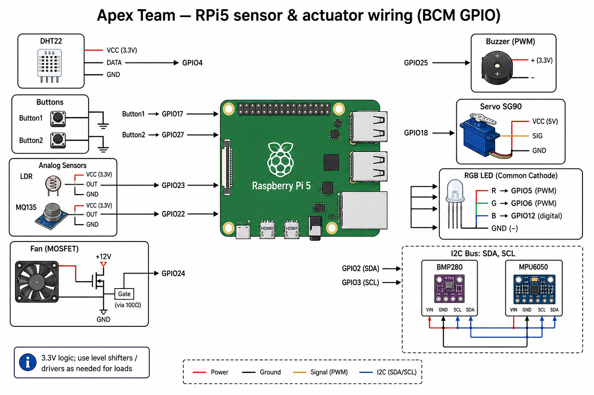
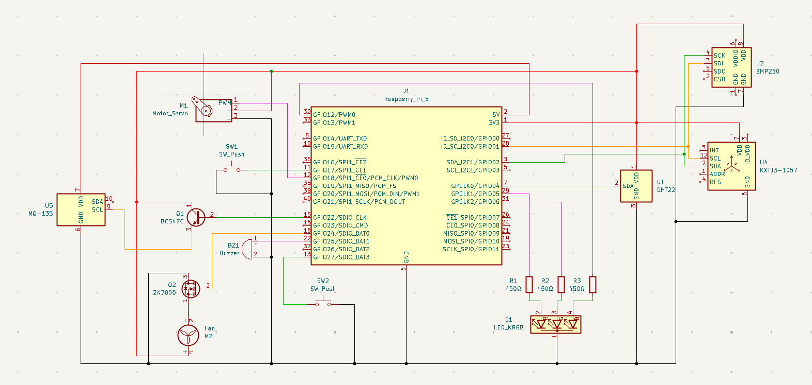

# Apex — Telemetry & Control Bridge (Siemens Hackathon)

This repository is part of **Team Apex**’s work for the **Siemens hackathon**. We built an end-to-end **telemetry and processing pipeline** so sensor data can leave the vehicle, reach a pit-side module, and drive decisions on a **Windows application** — either as operator guidance or as automatic actions on the car’s subsystems.

## The story in one lap

We treat the stack like a mini race setup:

| Role | Hardware | What it does |
|------|-----------|--------------|
| **The race car** | **Raspberry Pi 5** | Reads sensors, drives local outputs (fan, servo flaps, LEDs, buzzer), and exposes everything over **WebSockets**. |
| **The pit wall** | **ESP32** | Connects to the Pi, **receives live telemetry**, and **forwards** it to the Windows side. It can also relay **commands** back toward the Pi when the pit or automation decides to act. |
| **Race control / engineering** | **Windows app** | **Processes** telemetry, shows state to humans, and sends **instructions** or triggers **automatic control** for different modules on the vehicle. |

So the Pi is not “just a demo board”: in our narrative it is the **on-car brain** that sees the physical world; the ESP32 is the **radio bridge** to the pit; the PC is where **heavy logic and UX** live.

## Electrical schematics

### Quick GPIO reference (software defaults)

The diagram below matches the **BCM GPIO** numbers wired in **`hardware_apex_team.py`** by default (buttons, LDR/MQ135-style inputs, fan, buzzer, servo, RGB LED, DHT22, I2C sensors). Always use **proper drivers, current limits, and protection** for real loads — treat this as a **compact reference**, not a complete power/safety sign-off.



### Apex hardware schematic (detailed design)

This is the **team’s full electrical schematic** (components such as Raspberry Pi connector **J1**, BMP280 **U2**, DHT22 **U1**, accelerometer **U4**, MQ-135 **U5**, RGB LED **D1**, buzzer **BZ1**, fan **M2**, servo **M1**, switches **SW1/SW2**, and driver stages **Q1/Q2**). Use it for PCB bring-up and bench debugging.

If any **BCM pin** here differs from the defaults in `hardware_apex_team.py`, align either the wiring or **`servo_bcm` / GPIO usage** in code and config (`test_params.json`) so software and hardware stay in sync.



## What this codebase actually runs (`hardware_apex_team.py`)

The main script is a **Python 3** program for Raspberry Pi OS that does two things:

1. **Autonomous mode (default)** — start it with:

   ```bash
   python3 hardware_apex_team.py
   ```

   It launches a **multi-process** runtime (see next section) so sampling, telemetry, and command handling stay responsive. CPU cores can be **pinned per role** via `test_params.json`.

2. **Interactive hardware test menu** — for bench checks before you trust the car:

   ```bash
   python3 hardware_apex_team.py --menu
   ```

   You can exercise RGB LED, DHT22, I2C baro/IMU, buttons, fan, buzzer, servo, LDR/MQ135, optional single-process WebSocket streaming, and the same **multi-process** runtime used in autonomous mode.

**WebSocket defaults**

- **Telemetry out (Pi → clients):** `ws://<pi-host>:8765` — JSON snapshots of sensor readings, button states, throttle helper values, etc.
- **Commands in (clients → Pi):** `ws://<pi-host>:8766` — text commands the car understands (see below).

Settings are persisted in **`test_params.json`** (created on first run from built-in defaults).

## Multiprocessing, threading, and asyncio (why it is built this way)

The Pi program is deliberately **parallel** so one slow job does not freeze the whole car link.

### Multiprocessing — three processes

- **Sensor / GPIO process** — owns all **real hardware**: reads DHT22 and I2C (BMP280, MPU6050), digital inputs, builds the **telemetry snapshot**, updates **RGB LED** state, and **executes commands** coming from the RX path (fan, servo, buzzer, autonomy modes, etc.).
- **WebSocket TX process** — runs an **asyncio** server on **8765** and **broadcasts** the latest JSON snapshot to every connected client on a fixed interval (`ws_interval_sec`).
- **WebSocket RX process** — runs **asyncio** on **8766**, receives **text commands**, and bumps a shared **command sequence** so repeat messages still re-apply (useful for servo and stateful actions).

Processes talk through a **`multiprocessing.Manager`** (`shared_state`, `command_state`) and stop cleanly via a shared **`Event`**. The entrypoint forces **`spawn`** (not fork) when creating workers so **GPIO/PWM** behaviour stays predictable on **Raspberry Pi 5**.

### CPU affinity

Each process can be tied to a **preferred core** using `core_sensor`, `core_ws_tx`, and `core_ws_rx` in `test_params.json`. The code accepts both **0-based** and **1-based** core numbers and logs a warning if it has to remap.

### Threading inside the sensor process

- **Throttle ramp thread** — while **button 1** is held, a background thread ramps a **10–100%** throttle helper over a few seconds (used in the telemetry JSON for your higher-level logic).
- **Servo move thread** — servo motion uses a **short sleep** and then detaches PWM; running that on a **daemon thread** avoids blocking the main loop that must keep **DHT22 / I2C** reads on a steady schedule.

### Asyncio in the network processes

TX and RX servers use **`asyncio`** so multiple WebSocket clients can connect without one client stalling the whole stack — important when the **ESP32**, a browser, or debug tools are all online at once.

## What else the application can do

Beyond “read sensors and stream JSON,” the script is meant as a **small platform** you can extend:

- **Pit-style text commands** — `AUTONOMY:*` strings for **fan**, **servo** (open/close/mid), **LED** modes (connection white/red vs forced colours for “engine states”), **buzzer**, **SAFE_RESET**, and more; plus **throttle shaping** via `THROTTLE_BOOST`, `THROTTLE_LIMIT`, or `THROTTLE_SCALE` multipliers.
- **Connection-aware LED** — RGB feedback for **WebSocket activity** (separate awareness of **TX-only** vs **RX** clients so telemetry-only links still make sense).
- **Configurable telemetry** — host, ports, broadcast period, servo **BCM** pin, buzzer duty for safety tones, optional **traffic logging** (`ws_log_traffic`) and **WS debug flags** (`debug_ws_state`).
- **Bench workflow** — menu tests write structured entries to **`test_results.json`**; you can **view or edit parameters** interactively without editing JSON by hand.
- **Graceful multicore shutdown** — children are stopped in order; the parent can **re-open GPIO** for another menu session after autonomous mode.

## Sensors and why we care (mapping to the “car” idea)

These are the kinds of signals our stack is built around — the Windows side (or rules you add) can close the loop:

- **Temperature & humidity (DHT22)** — cabin or air path; useful context when you reason about cooling and comfort.
- **Pressure & altitude (BMP280)** — **atmospheric pressure** (and derived altitude); handy for environment and baro-corrected thinking.
- **MPU6050 (accelerometer + gyro)** — **G-load and motion**; you can derive rough dynamics cues (aggressive braking, cornering feel) alongside whatever speed model you use upstream.
- **MQ135-style digital input** — we treat it as an **air-quality / gas** indicator; in the hackathon story that supports **emissions / NOx-related** awareness (interpretation depends on calibration and wiring).
- **LDR** — light level for simple **day/night** or “cover open” style cues.
- **Buttons** — local overrides or physical inputs for demos and safety.

## Actuators and example closed-loop stories

The Pi can **act** immediately when telemetry and policy say so (policy can live on Windows and send commands via ESP32 path, or you can extend locally):

- **Oil too hot → cool it down** — drive the **fan** to pull air through an oil cooler or radiator segment (proportional strategies are up to your control software; the script exposes **ON/OFF** fan control and telemetry).
- **Need more downforce → move aero surfaces** — a **servo** can represent **flap / angle** actuation; commands can open, close, or set mid positions for load management.
- **RGB LED** — **visual cues** on the car for states like link status, warnings, or “engine modes” (the script maps several autonomy-style LED patterns).
- **Buzzer** — alerts for **safety hold** or attention-grabbing states.

The script also understands a set of **`AUTONOMY:*` text commands** (fan, servo positions, LED modes, buzzer, safe reset, throttle scaling keywords, etc.) so the Windows app or pit tooling can stay **simple JSON/text over WebSocket** without re-flashing the Pi for every demo tweak.

## Dependencies (Pi)

Install the Python pieces you need for your wiring:

```bash
pip install gpiozero websockets
```

For the listed sensors (when present):

- `adafruit-blinka`, `adafruit-circuitpython-dht`, BMP280 and MPU6050 CircuitPython libraries as appropriate for your environment.

Exact package names may vary slightly by distro; the source file header lists the intended stack.

## Project layout (minimal)

- **`hardware_apex_team.py`** — runtime, test menu, WebSocket TX/RX processes, GPIO/sensor loop, command handling.
- **`test_params.json`** — timing, ports, core preferences, servo pin, logging flags (auto-generated if missing).
- **`test_results.json`** — optional log of menu test outcomes and runtime metadata (when tests or runtime write to it).
- **`assets/electrical_schematic.png`** — simplified GPIO reference diagram (matches default script pins).
- **`Apex_Schematics.png`** — full Apex hardware schematic (KiCad / team design).

## One-line summary

**Team Apex** built a **communication and processing-oriented** path from **RPi5 “car” sensors and actuators** → **ESP32 “pit wall”** → **Windows analytics and control**, with this repo focusing on the **Raspberry Pi side**: honest hardware I/O, structured telemetry, and command execution for a hackathon-grade race narrative.
